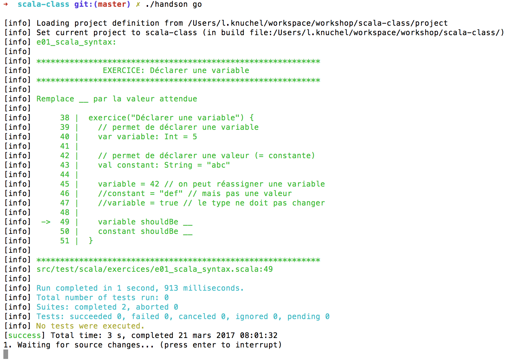

# Scala class

## Auteurs
### La version original :
- Fabrice Sznajderman [@fsznajderman](https://twitter.com/fsznajderman)
- Loïc Knuchel [@loicknuchel](https://twitter.com/loicknuchel)
- Walid Chergui [@walidchergui](https://twitter.com/walidchergui)
### La version mis à jour :
- Rakib SHEIKH
 
## Lancer le Hand's on

Pour lancer le Hand's on, suivre le [getting started](getting_started.md).

Si tout se passe bien le terminal devrait afficher :

Comme l'indique la dernière ligne, cette commande lance les tests puis attend des modifications dans les fichiers pour les lancer à nouveau.

Pour le moment le bonus n'est pas fonctionnel
> Des exercices plus avancés sont disponibles avec la commande `./handson bonus` \o/
